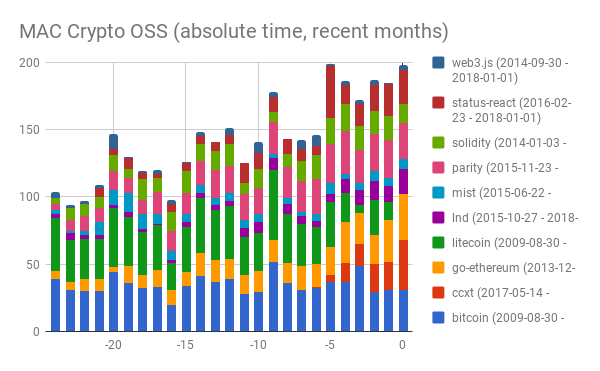
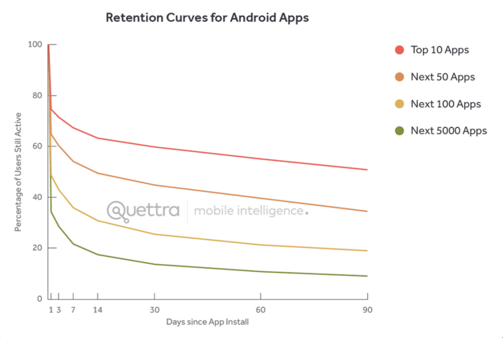
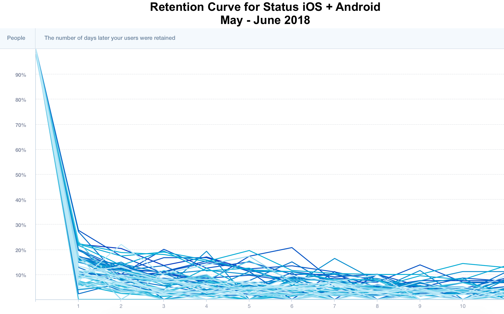
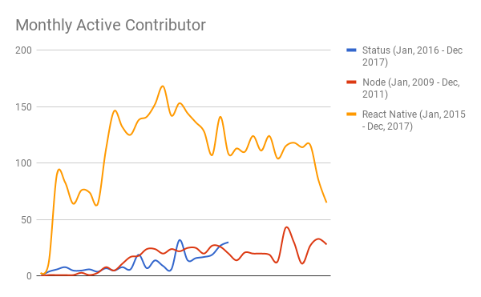
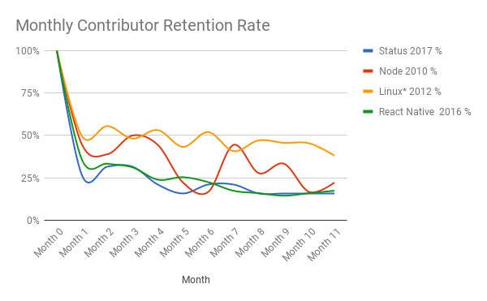

# Moved to [https://status.im/analytics/](https://status.im/analytics/)

This page is no longer maintained.

# Analytics for Status

Charts, scripts, links and sheets to calculate important metrics.

- User Analytics
  - [App Downloads](#app-downloads)
  - [Messages](#messages)
  - [ENS registrations](#ens-registrations)
- Other analytics
  - [Crypto OSS](#crypto-oss)
  - [Big OSS](#big-oss)
  - [Images](#images)
  - [Links](#links)
  - [Setup](#setup)

## User Analytics

### App Downloads

App download numbers are retrieved from the Status Appfigures account, which in turn is pulled from the Status Android Play Store account. Currently numbers are Android only, but iOS will be available after the App Store launch.

#### Net New Installs

New downloads minus uninstalls.

")
")

#### New downloads

")
")

#### App Updates

")
")

### Messages

Message status are calculated by looking at message counts and unique addresses counts participating in a handful of public chats ([see channels that are covered](https://github.com/status-im/infra-eth-cluster/blob/master/ansible/roles/statusd-pubchats-bot/defaults/main.yml#L17)).

")
")
")

### ENS registrations

Coming soon

## Other Analytics

Currently semi-manual and relying on Google Docs. At some point this will be scripted up and produced for general consumption. Only measures commits for status-react and some comparative-ish projects.

Why measure? See Android app example usage for impact, as well as organizational design. For further information, see FB Growth video linked below.

### Crypto OSS

### Big OSS

")
")

### Images

### Links

https://wiki.status.im/Status_Organisational_Design#Goals_of_Organisation

https://docs.google.com/spreadsheets/d/1B9rEC-pxS3-1c_FfevHi0TK9pNJRDLif5NtkpsFKJ30/edit#gid=0

http://startupclass.samaltman.com/courses/lec06/

https://en.wikipedia.org/wiki/Cohort_analysis

### SETUP

sudo apt-get install python-pip
sudo pip install python-dateutil

TODO: -1 vs -2 trailing /

#### TODO: Should just work in dir and go everywhere there
./mac.py ~/git-analytics/crypto/bitcoin/ ~/git-analytics/crypto/ccxt/ ~/git-analytics/crypto/go-ethereum/ ~/git-analytics/crypto/litecoin/ ~/git-analytics/crypto/lnd/ ~/git-analytics/crypto/mist/ ~/git-analytics/crypto/parity/ ~/git-analytics/crypto/solidity/ ~/git-analytics/crypto/status-react/ ~/git-analytics/crypto/web3.js/ > crypto-mac.csv

scp blue:~/git-analytics/crypto/crypto-mac.csv .
cat foo.csv | pbcopy

#### TODO

- TODO: Make absolute time graph 2 MAC automated with right time period (no manual excel stuff)
- TODO: Do MAC on biggest OSS like with Crypto OSS
- TODO: Write script for automatically checking M3 retention
- TODO: Do M3 retention check for Crypto/biggest OSS

#### Crypto OSS

oskarth@blue:~/git-analytics$ cat crypto-list.txt
https://github.com/bitcoin/bitcoin.git
https://github.com/ccxt/ccxt.git
https://github.com/litecoin-project/litecoin.git
https://github.com/lightningnetwork/lnd.git
https://github.com/status-im/status-react.git
https://github.com/ethereum/go-ethereum.git
https://github.com/ethereum/mist.git
https://github.com/ethereum/web3.js.git
https://github.com/paritytech/parity.git
https://github.com/ethereum/solidity.git
https://github.com/status-im/status-react.git

#### Big OSS

https://github.com/search?q=stars:%3E1&s=stars&type=Repositories

Selection of that seems to be real projects (not just random docs) and have lots of contributors. Based on first two pages quick scanning:

Also using: http://gitmostwanted.com/

https://github.com/twbs/bootstrap.git
https://github.com/tensorflow/tensorflow.git
https://github.com/facebook/react.git
https://github.com/facebook/react-native.git
https://github.com/torvalds/linux.git
https://github.com/electron/electron.git
https://github.com/jquery/jquery.git
https://github.com/nodejs/node.git
https://github.com/Microsoft/vscode.git
https://github.com/atom/atom.git
https://github.com/apple/swift.git
https://github.com/rails/rails.git
https://github.com/golang/go.git
https://github.com/angular/angular.js.git
https://github.com/opencv/opencv.git
https://github.com/git/git.git
https://github.com/Leaflet/Leaflet.git

TODO: Easy -24m do
TODO Manually clone: random:
https://github.com/llvm-mirror/llvm.git
https://github.com/freebsd/freebsd.git
https://github.com/chromium/chromium.git
https://github.com/mozilla/gecko-dev.git
https://github.com/aosp-mirror/platform_frameworks_base.git
https://github.com/apache/cassandra.git
https://github.com/apache/spark.git
https://github.com/apache/incubator-mxnet.git
https://github.com/apache/storm.git
https://github.com/clojure/clojurescript.git

for i in $(cat list.txt); do git clone $i; done
